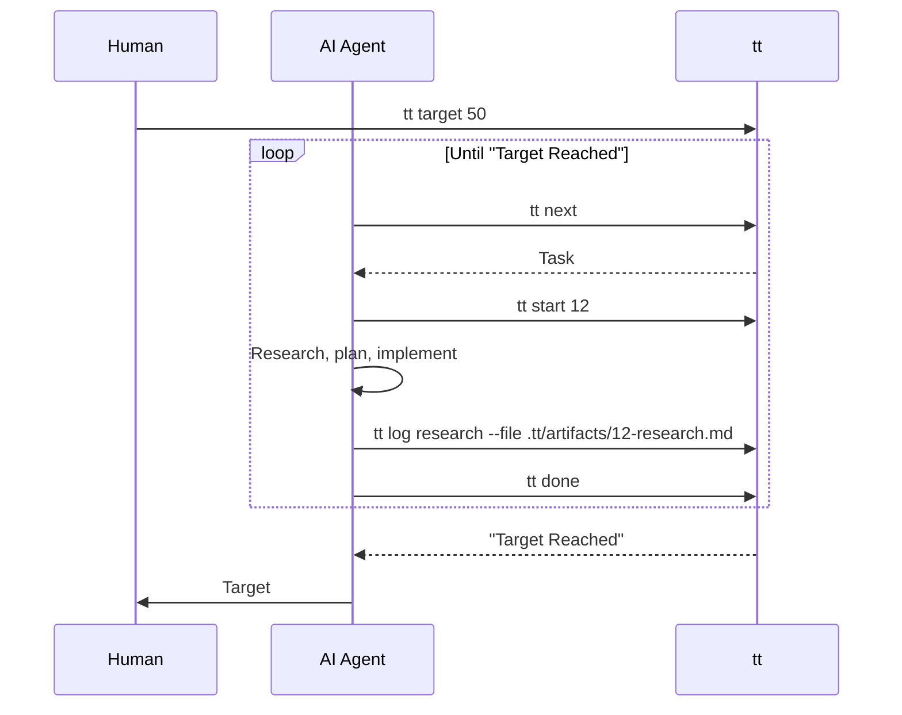
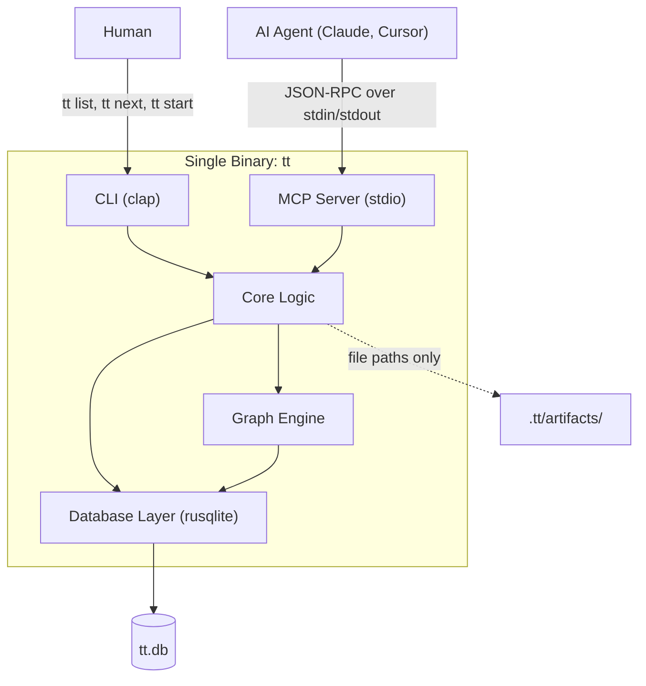
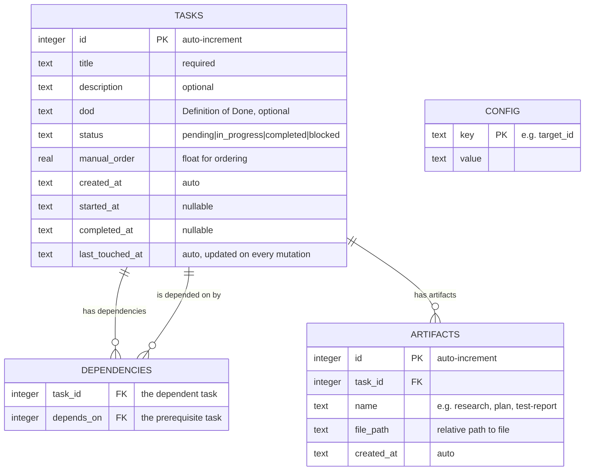
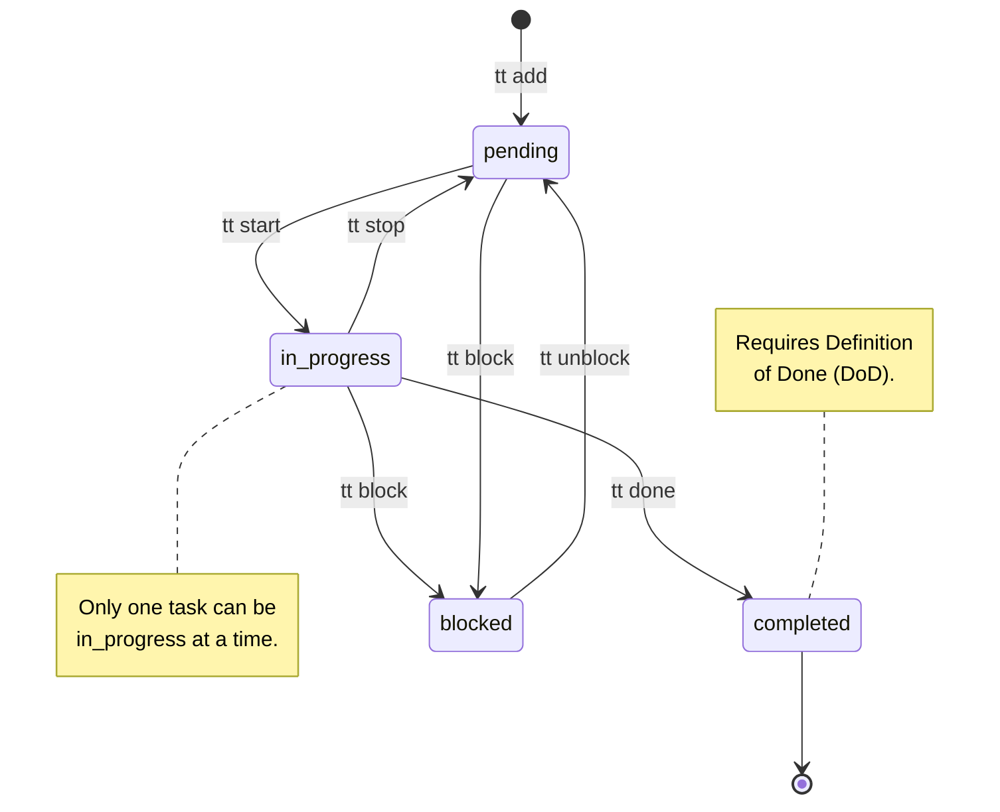
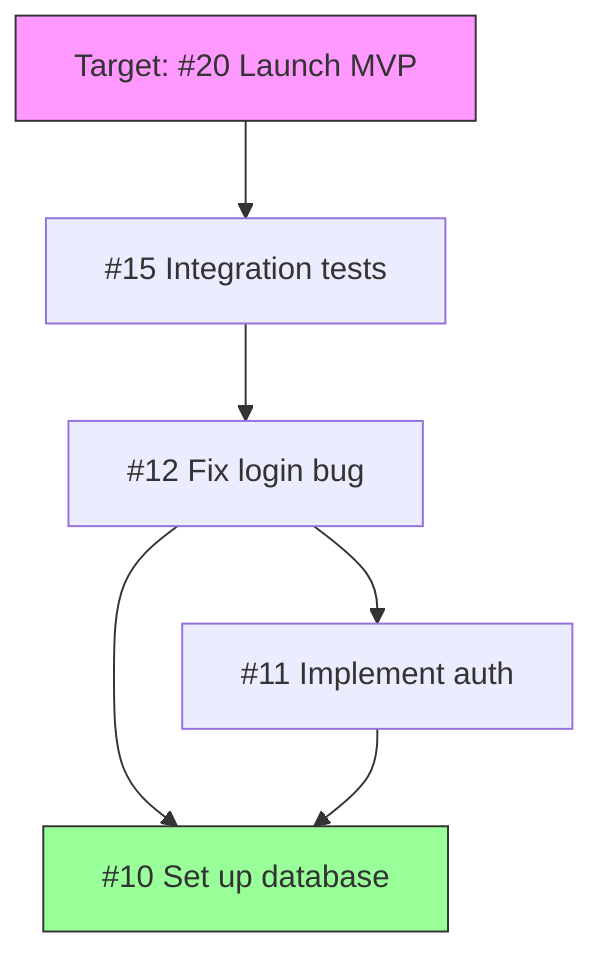
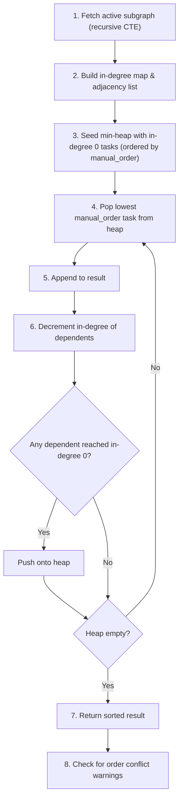

# `tt` — DAG-Based Task Tracker: Specification v3.0

## 1. Purpose & Motivation

`tt` is a single-binary CLI tool and MCP server written in Rust. It manages tasks as nodes in a Directed Acyclic Graph (DAG), stored in SQLite. It is designed to be driven by an AI coding agent, with a human setting high-level goals ("targets") and the AI autonomously executing work.

**The problem it solves:** Managing task dependencies as numbered markdown files (e.g., `123-foo.md`) breaks down when tasks need to be reordered, split into subtasks, or have their dependencies changed. Renumbering is painful and error-prone, and dependency ordering goes out of sync silently.

**The core loop:**



---

## 2. Technical Stack

- **Language:** Rust (latest stable edition).
- **Database:** SQLite via `rusqlite` (with `bundled` feature). WAL mode and foreign keys enabled.
- **CLI framework:** `clap` v4 with derive macros.
- **MCP:** Use one of the following, in order of preference based on maturity at time of implementation:
    1. **`clap-mcp`** (`gakonst/clap-mcp`) — derive macro that turns a clap CLI into an MCP server with minimal boilerplate. If this crate is mature enough, it is ideal because it avoids duplicating tool definitions.
    2. **`rmcp`** (`modelcontextprotocol/rust-sdk`) — the official Rust MCP SDK. More verbose but guaranteed spec compliance.
    3. **Manual implementation** — MCP over stdio is just newline-delimited JSON-RPC. If no crate is satisfactory, implement it by hand. The spec is at https://modelcontextprotocol.io.
- **MCP transport:** stdio only (the AI client spawns `tt mcp` as a child process).
- **Error handling:** `thiserror` for the error enum.
- **Timestamps:** `chrono` with `serde` feature.
- **Serialization:** `serde` and `serde_json`.

---

## 3. Architecture Overview



**Key architectural principle:** CLI and MCP are thin dispatchers. All business logic lives in the core layer. CLI formats output as human-readable text to stdout. MCP formats output as JSON. Both call the same core functions.

---

## 4. Data Model

### 4.1 Entity Relationship Diagram



### 4.2 Schema Constraints

- `status` column: CHECK constraint limiting to `pending`, `in_progress`, `completed`, `blocked`.
- `dependencies` table: composite PK on `(task_id, depends_on)`. CHECK constraint: `task_id != depends_on`.
- All datetime columns store ISO 8601 strings (`strftime('%Y-%m-%dT%H:%M:%S', 'now')`).
- Indexes on: `tasks(status)`, `tasks(manual_order)`, `dependencies(task_id)`, `dependencies(depends_on)`, `artifacts(task_id)`.

### 4.3 Config Table

Key-value store. In v1 the only key is `target_id` (stores a task ID as a string).

---

## 5. Invariants

These rules must **always** hold. Every command and every code path must enforce them.

| # | Invariant | Error Behaviour |
|:--|:----------|:----------------|
| 1 | **Single active task.** At most one task may have status `in_progress` at any time. | Fail with the ID and title of the currently active task. |
| 2 | **Dependencies gate starting.** A task cannot move to `in_progress` unless ALL of its direct dependencies have status `completed`. | Fail listing the IDs of unmet dependencies. |
| 3 | **No cycles.** The dependency graph must be a DAG. Adding an edge that creates a cycle must be rejected BEFORE committing. | Fail with the full cycle path as a list of task IDs. |
| 4 | **DoD required for completion.** A task cannot move to `completed` if its `dod` field is null or empty. | Fail instructing the user to set a DoD. |
| 5 | **Topological correctness.** `list` and `next` output must always respect the dependency graph. A prerequisite must never appear after its dependent. | This is a correctness property of the sorting algorithm, not a runtime check. |
| 6 | **No deletion.** v1 does not support deleting tasks. | Return "not supported" error. |
| 7 | **Every mutation updates `last_touched_at`.** | Enforced in the database layer. |

---

## 6. Status Transitions



### Transition Rules

| From | To | Command | Guards | Side Effects |
|:-----|:---|:--------|:-------|:-------------|
| pending | in_progress | `start <id>` | No other task is `in_progress`. All deps are `completed`. | Set `started_at` to now. |
| in_progress | pending | `stop` | A task must be active. | Does NOT clear `started_at`. |
| in_progress | completed | `done` | A task must be active. `dod` must be non-empty. | Set `completed_at` to now. |
| pending | blocked | `block <id>` | Task must be `pending`. | — |
| in_progress | blocked | `block <id>` | Task must be `in_progress`. | Clears the active slot. |
| blocked | pending | `unblock <id>` | Task must be `blocked`. | — |

No other transitions are valid. `completed` is a terminal state. Attempting an invalid transition (e.g., starting a `blocked` task, completing a `pending` task) returns a clear error.

**Special case:** `tt start <id>` where `<id>` is already `in_progress` should succeed as a no-op and return the task, not error.

---

## 7. Ordering System

### 7.1 The Two Layers of Order

Task execution order is determined by two factors, in strict priority:

1. **Topological order (dependencies):** A prerequisite always comes before its dependent. Non-negotiable.
2. **Manual order (the `manual_order` float):** Among tasks with no dependency relationship between them, the lower `manual_order` wins.

### 7.2 Manual Order as a Float

`manual_order` is `REAL` (f64) to allow arbitrary insertion without renumbering.

| Scenario | Calculation |
|:---------|:------------|
| New task, no positioning hint | `MAX(manual_order) + 10.0` (or `10.0` if no tasks exist) |
| Insert between task A and task B | `(A.manual_order + B.manual_order) / 2.0` |
| Insert after task A only | `A.manual_order + 10.0` |
| Insert before task B only | `B.manual_order - 10.0` |

**Float precision exhaustion:** If a midpoint calculation produces a value equal to either neighbour (f64 limit), the operation should fail and suggest `tt reindex`.

**Reindexing:** `tt reindex` reassigns all `manual_order` values to `10.0, 20.0, 30.0, ...` preserving current sorted order. Expected to be run rarely.

### 7.3 Order Conflict Warnings

After computing a topological sort, the tool should check: does any task have a lower `manual_order` than one of its prerequisites? If so, emit a **warning** to stderr. This is not an error (the topological sort is still correct), but it tells the human their manual ordering contradicts the dependency graph.

---

## 8. The Target System

### 8.1 Purpose

A target is a single task ID representing a milestone. When set, `tt list` and `tt next` only consider the subgraph of tasks that are **transitive dependencies** of the target, plus the target itself.

### 8.2 Target Walk



To compute the relevant subgraph, use a **recursive CTE** in SQLite:

1. Start with the target task.
2. Recursively follow `dependencies.depends_on` edges.
3. Filter out tasks with status `completed`.
4. The result is the "active subgraph."

### 8.3 Behaviour

- `tt next` and `tt list` (without `--all`) only operate on the active subgraph.
- `tt list --all` shows every task in the database.
- If no target is set, `tt next` and `tt list` (without `--all`) return an error: "No target set."
- If the active subgraph is empty (all done), return "Target Reached."

---

## 9. The Sorting Algorithm

### 9.1 Kahn's Algorithm with Priority Queue



**Implementation note:** Rust's `BinaryHeap` is a max-heap. Use a newtype wrapper with reversed `Ord` to get min-heap behaviour on `manual_order`.

### 9.2 The `next` Command

`next` returns the **first task in the sorted order** where:
- Status is `pending`.
- All direct dependencies are `completed`.

If no such task exists but uncompleted tasks remain, they must all be `blocked`. Return an error listing the blocked tasks.

---

## 10. Cycle Detection

When adding a dependency edge `A depends on B`, before committing:

1. Perform a DFS from `B`, following existing `depends_on` edges.
2. If `A` is reachable from `B`, a cycle would be created.
3. Reject the operation and return the full cycle path (list of task IDs from `A` back to `A`).

This check must happen inside a transaction, before the INSERT.

---

## 11. CLI Commands

### 11.1 Project Lifecycle

| Command | Behaviour |
|:--------|:----------|
| `tt init` | Creates `tt.db` in the current directory and `.tt/artifacts/` directory. Fails if already initialised. |

All other commands fail with a clear error if `tt.db` is not found in the current directory.

### 11.2 Task Management

| Command | Behaviour |
|:--------|:----------|
| `tt add "<title>"` | Creates a task. Optional flags: `--desc`, `--dod`, `--after <id>`, `--before <id>`. Prints the new task ID. |
| `tt edit <id>` | Updates fields. Flags: `--title`, `--desc`, `--dod`. Only provided fields are changed. |
| `tt show <id>` | Prints full task detail (see Section 13). |
| `tt list` | Prints target subgraph in topological order. `--all` flag shows every task. |

### 11.3 Workflow

| Command | Behaviour |
|:--------|:----------|
| `tt target <id>` | Sets the target. Verifies the task exists. |
| `tt next` | Prints the next task to work on (see Section 9.2). |
| `tt start <id>` | Moves task to `in_progress` (see Section 6). |
| `tt stop` | Moves active task back to `pending`. |
| `tt done` | Moves active task to `completed`. |
| `tt block <id>` | Moves task to `blocked`. |
| `tt unblock <id>` | Moves blocked task to `pending`. |
| `tt current` | Prints active task details and artifacts. Errors if nothing is active. |

### 11.4 Dependencies

| Command | Behaviour |
|:--------|:----------|
| `tt depend <id> <on_id>` | Task `<id>` depends on task `<on_id>`. Fails on cycle (with cycle path in error). |
| `tt undepend <id> <on_id>` | Removes a dependency. |

### 11.5 Artifacts

| Command | Behaviour |
|:--------|:----------|
| `tt log <name> --file <path>` | Links a file path to the active task. Fails if no task is active. Does NOT verify the file exists. |
| `tt artifacts` | Lists artifacts for the active task. `--task <id>` to query a specific task. |

### 11.6 Ordering

| Command | Behaviour |
|:--------|:----------|
| `tt reorder <id>` | Moves a task's `manual_order`. Requires at least one of `--after <id>` or `--before <id>`. |
| `tt reindex` | Reassigns all `manual_order` to clean integers preserving current order. |

### 11.7 MCP

| Command | Behaviour |
|:--------|:----------|
| `tt mcp` | Starts the MCP server over stdio. Does not return until the client disconnects. |

---

## 12. CLI Output Format

### 12.1 Design Principles

- Human-readable, compact text to stdout.
- Errors to stderr, exit code 1.
- Status indicators: `✓` completed, `●` in\_progress, `○` pending, `✗` blocked.

### 12.2 `tt list`

```text
Target: #20 (Launch MVP)
  [#10] ✓ Set up database
  [#11] ○ Implement auth           (deps: #10 ✓)
  [#12] ○ Fix login bug            (deps: #10 ✓, #11 ○)
  [#15] ○ Write integration tests  (deps: #12 ○)
  [#20] ○ Launch MVP               (deps: #15 ○)

Legend: ✓ completed  ● in_progress  ○ pending  ✗ blocked
```

### 12.3 `tt show <id>`

```text
[#12] Fix login bug
Status:       pending
Order:        30.0
Created:      2025-06-01 10:00
DoD:          User can log in with email and password

Dependencies: #10 (✓), #11 (○)
Dependents:   #15
Artifacts:    (none)
```

### 12.4 `tt next`

```text
Next: [#11] Implement auth
  Dependencies: #10 ✓ (all met)
  DoD: JWT-based auth with refresh tokens
```

If target reached:
```text
Target Reached: all tasks for #20 (Launch MVP) are completed.
```

If all remaining are blocked:
```text
All remaining tasks are blocked:
  [#12] ✗ Fix login bug — blocked
  [#15] ✗ Write tests — waiting on: #12 (✗)
```

### 12.5 `tt current`

```text
Active: [#11] Implement auth
  Status:    in_progress
  Started:   2025-06-02 09:30
  DoD:       JWT-based auth with refresh tokens
  Artifacts:
    - research: .tt/artifacts/11-research.md
    - plan:     .tt/artifacts/11-plan.md
```

### 12.6 Errors

```text
Error: Task #5 is already in progress. Finish or stop it first.
```

---

## 13. MCP Server

### 13.1 Transport

stdio. The AI client spawns `tt mcp` and communicates via stdin/stdout using MCP JSON-RPC.

### 13.2 Tools to Expose

Every CLI command from Section 11 (except `init`, `mcp`, `reindex`) should be exposed as an MCP tool. If using `clap-mcp`, this may be automatic. If implementing manually, register each tool with a name, description, input JSON Schema, and handler.

| Tool Name | Parameters | Returns |
|:----------|:-----------|:--------|
| `get_next_task` | (none) | Next task object or "Target Reached" / blocked list |
| `get_current_task` | (none) | Active task + artifacts |
| `start_task` | `{ id: int }` | Started task object |
| `complete_task` | (none) | Completed task object |
| `stop_task` | (none) | Stopped task object |
| `create_task` | `{ title: str, description?: str, dod?: str, after_id?: int, before_id?: int }` | New task object |
| `edit_task` | `{ id: int, title?: str, description?: str, dod?: str }` | Updated task object |
| `add_dependency` | `{ task_id: int, depends_on: int }` | Confirmation |
| `remove_dependency` | `{ task_id: int, depends_on: int }` | Confirmation |
| `block_task` | `{ id: int }` | Blocked task object |
| `unblock_task` | `{ id: int }` | Unblocked task object |
| `list_tasks` | `{ all?: bool }` | Array of task objects in sorted order |
| `show_task` | `{ id: int }` | Full task detail object |
| `log_artifact` | `{ name: str, file_path: str }` | Artifact object |
| `get_artifacts` | `{ task_id?: int }` | Array of artifact objects |
| `set_target` | `{ id: int }` | Confirmation |
| `reorder_task` | `{ id: int, after_id?: int, before_id?: int }` | New order value |

### 13.3 Response Format

All MCP tool responses return structured JSON (not the human-readable CLI text).

**Success:**
```json
{ "status": "ok", "data": { ... } }
```

**Error:**
```json
{
  "status": "error",
  "error_code": "AnotherTaskActive",
  "message": "Task #5 is already in progress. Finish or stop it first."
}
```

The `error_code` maps to the error variant name so the AI can react programmatically (e.g., if `AnotherTaskActive`, call `stop_task` first).

### 13.4 Tool Descriptions

Tool descriptions are how the AI understands when and why to use each tool. Write them as instructions, not documentation. Examples:

- `get_next_task`: *"Returns the next task to work on toward the current target. Call this after completing a task. If the response is TargetReached, stop working and report to the user."*
- `log_artifact`: *"Records a file you have created as an artifact of the current task. Create the file first, then call this. Use descriptive names like 'research', 'plan', 'implementation-notes', 'test-report'."*
- `create_task`: *"Creates a new task. If you discover during implementation that a task needs to be broken into smaller pieces, create subtasks and add dependencies."*

---

## 14. File System Layout

```text
project/
├── tt.db
└── .tt/
    └── artifacts/
        ├── 11-research.md
        ├── 11-plan.md
        └── 12-test-report.md
```

- `.tt/` is created by `tt init`.
- The tool never reads or writes artifact file contents. It only stores paths.
- The AI agent or user is responsible for creating files before calling `tt log`.

---

## 15. Error Taxonomy

The implementation should define a single error enum. Each variant should produce a clear, actionable message. The following variants are required:

| Variant | When | Message Template |
|:--------|:-----|:-----------------|
| `TaskNotFound(id)` | Any operation on a nonexistent ID | "Task #\{id\} not found" |
| `TaskNotPending(id)` | `start` on a non-pending task | "Task #\{id\} is not pending, cannot start" |
| `AnotherTaskActive(id)` | `start` when another is active | "Task #\{id\} is already in progress. Finish or stop it first." |
| `NoActiveTask` | `stop`, `done`, `log` with no active task | "No task is currently in progress" |
| `UnmetDependencies(id, Vec<id>)` | `start` with unmet deps | "Cannot start #\{id\}: dependencies not completed: #X, #Y" |
| `CycleDetected(from, to, Vec<id>)` | `depend` would create cycle | "Adding #\{from\} → #\{to\} would create a cycle: #A → #B → #C → #A" |
| `NoTarget` | `next` or `list` without target | "No target set. Use \`tt target <id>\` first." |
| `TargetReached(id)` | `next` when all done | "Target reached. All tasks for #\{id\} are completed." |
| `NoDod(id)` | `done` with no DoD | "Task #\{id\} has no definition of done. Set one with \`tt edit \{id\} --dod\`" |
| `OrderConflict(...)` | Warning only, after sort | "Warning: #\{id\} (order \{x\}) depends on #\{dep\} (order \{y\}) which has higher manual\_order" |
| `InvalidStatus(s)` | Bad status string | "Invalid status: \{s\}" |
| `AllBlocked(Vec<id>)` | `next` when remaining tasks blocked | "All remaining tasks are blocked: #X, #Y" |
| `Db(rusqlite::Error)` | Database error | Passthrough |
| `Io(std::io::Error)` | File system error | Passthrough |

---

## 16. Edge Cases & Behavioural Notes

1. **Float precision:** If `midpoint(a, b)` returns a value `== a` or `== b`, fail and suggest `tt reindex`.
2. **Multiple targets:** v1 supports one target. Setting a new one overwrites the old.
3. **Orphan tasks:** Tasks not in any target subgraph are only visible via `tt list --all` and `tt show <id>`.
4. **Re-starting a completed task:** Not allowed. `completed` is terminal in v1.
5. **Idempotent start:** `tt start <id>` where `<id>` is already `in_progress` succeeds as a no-op.
6. **Concurrent access:** v1 assumes single-writer. SQLite WAL provides safe concurrent reads.
7. **Database location:** Always `tt.db` in the current working directory.
8. **Empty database:** `tt list` with no tasks prints nothing. `tt next` says "No target set" or "Target Reached" as appropriate.
9. **Dependency on completed task:** Allowed and valid. A completed task is a satisfied dependency.
10. **Blocking the active task:** `tt block <id>` where `<id>` is active should move it to `blocked` and clear the active slot.

---

## 17. Testing Strategy

The implementor should write tests covering these scenarios. The structure and framework are at the implementor's discretion.

### 17.1 Graph Logic

| Scenario | Expected |
|:---------|:---------|
| Linear chain A → B → C | Sort produces [A, B, C] |
| Diamond: A → B, A → C, B → D, C → D | A first, D last. B vs C decided by `manual_order` |
| Manual order tiebreaking | Two independent tasks: lower `manual_order` first |
| Cycle detection: A → B → C → A | Error with cycle path `[A, B, C, A]` |
| Self-dependency | Rejected by DB CHECK constraint |
| Midpoint: `mid(1.0, 2.0)` | `1.5` |
| Order conflict | Task depends on task with higher `manual_order` → warning |

### 17.2 State Machine

| Scenario | Expected |
|:---------|:---------|
| Start task while another is active | Error naming active task |
| Start task with unmet deps | Error listing unmet IDs |
| Complete task with no DoD | Error |
| Block active task | Clears active slot, moves to blocked |
| Unblock a pending task | Error (must be blocked) |
| Complete a pending task directly | Error (must be in\_progress) |
| Start an already-in-progress task | No-op success |

### 17.3 Target Walk

| Scenario | Expected |
|:---------|:---------|
| Deep dependency chain | All ancestors returned, completed ones excluded |
| Target with no dependencies | Subgraph is just the target |
| All tasks completed | "Target Reached" |
| All remaining blocked | Error listing blocked tasks |

### 17.4 End-to-End (CLI Integration)

Run the built binary as a subprocess and verify output:

1. `tt init` → creates `tt.db` and `.tt/artifacts/`.
2. `tt add "Task A"` → prints ID 1.
3. `tt add "Task B"` → prints ID 2.
4. `tt depend 2 1` → success.
5. `tt target 2` → success.
6. `tt next` → returns Task 1.
7. `tt start 1` → success.
8. `tt done` → error (no DoD).
9. `tt edit 1 --dod "Schema exists"` → success.
10. `tt done` → success.
11. `tt next` → returns Task 2.
12. `tt edit 2 --dod "Feature works"` → success.
13. `tt start 2` → success.
14. `tt done` → success.
15. `tt next` → "Target Reached."

---

## 18. Future Considerations (Out of Scope for v1)

These are explicitly **not** part of this spec but are worth noting for future versions:

- **Task deletion** with cascading dependency cleanup.
- **Multiple targets** / task groups.
- **Time tracking** (duration between `started_at` and `completed_at`).
- **Priority field** separate from `manual_order`.
- **Task templates** for common patterns (e.g., "RPI task" auto-creates research → plan → implement subtasks).
- **Export/import** to/from markdown files.
- **Web UI** reading from the same SQLite database.
